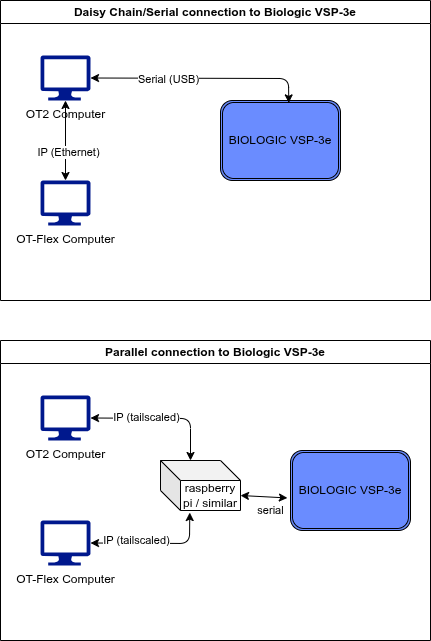

# Biologic Potentiostat

Driver for the Biologic VSP-3e potentiostat. 

> **Note**: This driver is written from the scope of the OT-Flex device. This device must connect to the OT2 computer which will run the biologic commands. See the image below for the connection diagram.

## SSH via paramiko to run commands
- src/SSH_RemoteCommands.ipynb
- attempt to run biologic commands over IP on other computer
    - it was noted that multiple channels of the biologic can be used in parallel by 1 computer
        - this fact will be exploited to run biologic commands from this ot-flex client computer
        

